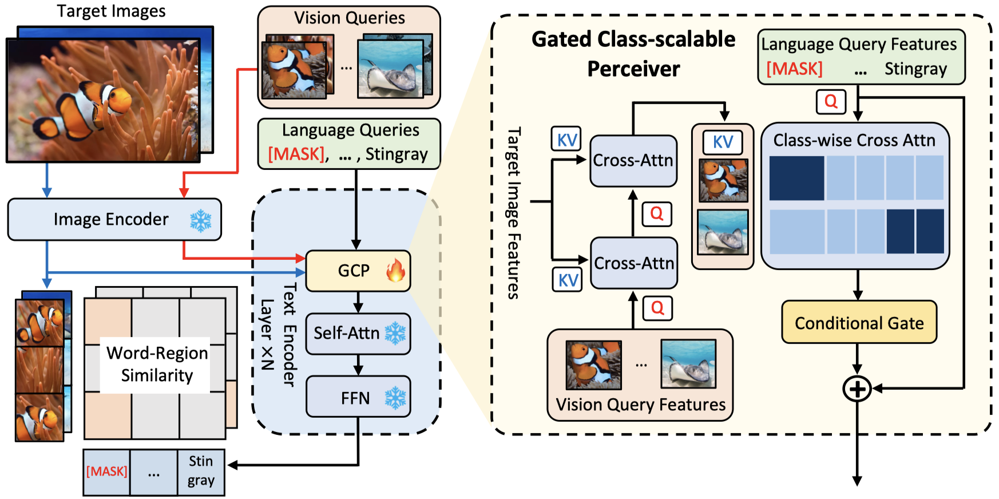

# Multi-modal Queried Object Detection in the Wild

[](https://paperswithcode.com/sota/zero-shot-object-detection-on-lvis-v1-0?p=multi-modal-queried-object-detection-in-the)
[](https://paperswithcode.com/sota/zero-shot-object-detection-on-lvis-v1-0-val?p=multi-modal-queried-object-detection-in-the)
[](https://paperswithcode.com/sota/zero-shot-object-detection-on-odinw?p=multi-modal-queried-object-detection-in-the)
[](https://paperswithcode.com/sota/few-shot-object-detection-on-odinw-13?p=multi-modal-queried-object-detection-in-the)
[](https://paperswithcode.com/sota/few-shot-object-detection-on-odinw-35?p=multi-modal-queried-object-detection-in-the)


Official code and models for the NeurIPS 2023 paper:

[**Multi-modal Queried Object Detection in the Wild**](https://arxiv.org/abs/2305.18980)

Yifan Xu, Mengdan Zhang, Chaoyou Fu, Peixian Chen, Xiaoshan Yang, Ke Li, Changsheng Xu

NeurIPS 2023


MQ-Det is the first multi-modal queried open-world object detector. If you have any questions, please feel free to raise an issue or email <yifan.xu@nlpr.ia.ac.cn>.

## Updates

10/20/2023: Updated an instruction on modulating on customized datasets! Please refer to [CUSTOMIZED_PRETRAIN.md](CUSTOMIZED_PRETRAIN.md).

10/09/2023: Complete code and models are released!

09/22/2023: MQ-Det has beed accepted by NeurIPS 2023 ([Updated Verision](https://arxiv.org/abs/2305.18980)).

05/30/2023: MQ-Det paper on arxiv https://arxiv.org/abs/2305.18980.

05/27/2023: Finetuning-free code and models are released.

05/25/2023: Project page built.

## Citation

If you find our work useful in your research, please consider citing:
```
@article{xu2023multi,
  title={Multi-modal Queried Object Detection in the Wild},
  author={Xu, Yifan and Zhang, Mengdan and Fu, Chaoyou and Chen, Peixian and Yang, Xiaoshan and Li, Ke and Xu, Changsheng},
  journal={arXiv preprint arXiv:2305.18980},
  year={2023}
}
```


## Multi-modal Queried Object Detection
We introduce **MQ-Det**, an efficient architecture and pre-training strategy design to utilize both textual description with open-set generalization and visual exemplars with rich description granularity as category queries, namely, **M**ulti-modal **Q**ueried object **Det**ection, for real-world detection with both open-vocabulary categories and various granularity. 

 

## Method
MQ-Det incorporates vision queries into existing well-established language-queried-only detectors.

**Features**:

- A plug-and-play gated class-scalable perceiver module upon the frozen detector.  Corresponding code is implemented [here](https://github.com/YifanXu74/MQ-Det/blob/5c4a739a79b04e2ba6bf6a42697bbc6bd3b67e79/maskrcnn_benchmark/modeling/language_backbone/modeling_bert_new.py#L250C2-L250C2).
- A vision conditioned masked language prediction strategy. Corresponding code is implemented [here](https://github.com/YifanXu74/MQ-Det/blob/5c4a739a79b04e2ba6bf6a42697bbc6bd3b67e79/maskrcnn_benchmark/modeling/detector/generalized_vl_rcnn_new.py#L397-L407).
- Compatible with most language-queried object detectors.

<!-- ## TODO 

- [x] Release finetuning-free inference code.
- [x] Release checkpoints.
- [x] Release fine-tuning code.
- [x] Release modulated training code.
- [ ] More detailed instruction on applying MQ-Det to custom language-queried detectors. -->


## Preparation

**Environment.** 
Init the  environment:
```
git clone https://github.com/YifanXu74/MQ-Det.git
cd MQ-Det
conda create -n mqdet python=3.9 -y
conda activate mqdet
bash init.sh
```

The implementation environment in the paper is python==3.9, torch==2.0.1, GCC==8.3.1, CUDA==11.7. Several  potential errors and their solutions are presented in [DEBUG.md](DEBUG.md)
<!-- THC/THC.h error with high torch version can be solved by [link1](https://github.com/NVIDIA/DeepLearningExamples/issues/1090) and [link2](https://aitechtogether.com/python/76425.html) -->

**Data.**  Prepare ``Objects365`` (for modulated pre-training), ``LVIS`` (for evaluation), and ``ODinW`` (for evaluation) benchmarks following [DATA.md](DATA.md).

**Initial Weight.** MQ-Det is build upon frozen language-queried detectors. To conduct modulated pre-training, download corresponding pre-trained model weights first.

We apply MQ-Det on [GLIP](https://github.com/microsoft/GLIP) and [GroundingDINO](https://github.com/IDEA-Research/GroundingDINO):

```
GLIP-T:
wget https://huggingface.co/GLIPModel/GLIP/resolve/main/glip_tiny_model_o365_goldg_cc_sbu.pth -O MODEL/glip_tiny_model_o365_goldg_cc_sbu.pth
GLIP-L:
wget https://huggingface.co/GLIPModel/GLIP/resolve/main/glip_large_model.pth -O MODEL/glip_large_model.pth
GroundingDINO-T:
wget https://huggingface.co/ShilongLiu/GroundingDINO/resolve/main/groundingdino_swint_ogc.pth -O MODEL/groundingdino_swint_ogc.pth
```
If the links fail, please manually download corresponding weights from the following table or the github pages of [GLIP](https://github.com/microsoft/GLIP)/[GroundingDINO](https://github.com/IDEA-Research/GroundingDINO).

|GLIP-T|GLIP-L|GroundingDINO-T|
|------|------|------|
|[weight](https://huggingface.co/GLIPModel/GLIP/resolve/main/glip_tiny_model_o365_goldg_cc_sbu.pth)|[weight](https://huggingface.co/GLIPModel/GLIP/resolve/main/glip_large_model.pth)|[weight](https://huggingface.co/ShilongLiu/GroundingDINO/resolve/main/groundingdino_swint_ogc.pth)|

The weight files should be placed as follows:

```
MODEL/
    glip_tiny_model_o365_goldg_cc_sbu.pth
    glip_large_model.pth
    groundingdino_swint_ogc.pth
```

## Model Zoo
The table reports the finetuning-free performance with 5 vision queries.
Model | LVIS MiniVal | LVIS Val v1.0 | ODinW-13 | ODinW-35 | Config  | Weight |
-- | -- | -- | -- | -- | -- | -- |
MQ-GLIP-T | 30.4 | 22.6 | 45.6 | 20.8 | [config](configs/pretrain/mq-glip-t.yaml)  | [weight](https://drive.google.com/file/d/1n0_D-tisqN5v-IESUEIGzMuO-9wolXiu/view?usp=sharing) |
MQ-GLIP-L | 43.4 | 34.7 | 54.1 | 23.9 | [config](configs/pretrain/mq-glip-l.yaml)  | [weight](https://drive.google.com/file/d/1O_eb1LrlNqpEsoxD23PAIxW8WB6sGoBO/view?usp=sharing) |

## Vision Query Extraction 

**Take MQ-GLIP-T as an example.**

If you wish to extract vision queries from custom dataset, specify the  ``DATASETS.TRAIN`` in the config file.
We provide some examples in our implementation in the following.

### Objects365 for modulated pre-training:

```
python tools/extract_vision_query.py --config_file configs/pretrain/mq-glip-t.yaml --dataset objects365 --add_name tiny 
```
This will generate a query bank file in ``MODEL/object365_query_5000_sel_tiny.pth``


### LVIS for downstream tasks:
```
python tools/extract_vision_query.py --config_file configs/pretrain/mq-glip-t.yaml --dataset lvis --num_vision_queries 5 --add_name tiny
```
This will generate a query bank file in ``MODEL/lvis_query_5_pool7_sel_tiny.pth``.


### ODinW for downstream tasks:

```
python tools/extract_vision_query.py --config_file configs/pretrain/mq-glip-t.yaml --dataset odinw-13 --num_vision_queries 5 --add_name tiny
```
This will generate query bank files for each dataset in ODinW in  ``MODEL/{dataset}_query_5_pool7_sel_tiny.pth``.

### Some paramters corresponding to the query extraction:

The above [script](tools/extract_vision_query.py) has already set all paramters well. One only needs to pass:

``--config_file`` is the pretraining config files.

``--dataset`` contains some pre-defined datasets including ``objects365``, ``lvis``, ``odinw-13``, and ``odinw-35``.

``--num_vision_queries`` controls the number of vision queries for each category you want to extract from the training dataset, and can be an arbitrary number. This will set both ``VISION_QUERY.MAX_QUERY_NUMBER`` and ``DATASETS.FEW_SHOT`` to ``num_vision_queries``.
Note that here ``DATASETS.FEW_SHOT`` is only for accelerating the extraction process.

``--add_name`` is only a mark for different models.
For training/evaluating with MQ-GLIP-T/MQ-GLIP-L/MQ-GroundingDINO, we set ``--add_name`` to 'tiny'/'large'/'gd'.

For customized usage, one can modify the commands in the [script](tools/extract_vision_query.py), or pass additional parameters through ``--opt``, for example,
```
python tools/extract_vision_query.py --config_file configs/pretrain/mq-glip-t.yaml --dataset lvis --opt 'VISION_QUERY.MAX_QUERY_NUMBER 50 DATASETS.FEW_SHOT 50'
```

Here are several parameters may be used during query extraction, more details can be found in the [code](maskrcnn_benchmark/config/defaults.py):

``DATASETS.FEW_SHOT``: if set ``k>0``, the dataset will be subsampled to k-shot for each category when initializing the dataset. This is completed before training. Not used during pre-training.

``VISION_QUERY.MAX_QUERY_NUMBER``: the max number of vision queries for each category when extracting the query bank. Only used during query extraction. Note that the query extraction is conducted before training and evaluation.

``VISION_QUERY.NUM_QUERY_PER_CLASS`` controls how many queries to provide for each category during one forward process in training and evaluation. Not used during query extraction.

Usually, we set 

``VISION_QUERY.MAX_QUERY_NUMBER=5000``, ``VISION_QUERY.NUM_QUERY_PER_CLASS=5``, ``DATASETS.FEW_SHOT=0`` during pre-training. 

``VISION_QUERY.MAX_QUERY_NUMBER=k``, ``VISION_QUERY.NUM_QUERY_PER_CLASS=k``, ``DATASETS.FEW_SHOT=k`` during few-shot (k-shot) fine-tuning.

## Modulated Training

**Take MQ-GLIP-T as an example.**

```
python -m torch.distributed.launch --nproc_per_node=8 tools/train_net.py --config-file configs/pretrain/mq-glip-t.yaml --use-tensorboard OUTPUT_DIR 'OUTPUT/MQ-GLIP-TINY/'
```
To conduct pre-training, one should first extract vision queries before start training following the above [instruction](#vision-query-extraction).

To pre-train on custom datasets, please specify ``DATASETS.TRAIN`` and ``VISION_SUPPORT.SUPPORT_BANK_PATH`` in the config file. More details can be found in [CUSTOMIZED_PRETRAIN.md](CUSTOMIZED_PRETRAIN.md).

## Finetuning-free Evaluation
**Take MQ-GLIP-T as an example.**

### LVIS Evaluation
MiniVal:
```
python -m torch.distributed.launch --nproc_per_node=4 \
tools/test_grounding_net.py \
--config-file configs/pretrain/mq-glip-t.yaml \
--additional_model_config configs/vision_query_5shot/lvis_minival.yaml \
VISION_QUERY.QUERY_BANK_PATH MODEL/lvis_query_5_pool7_sel_tiny.pth \
MODEL.WEIGHT ${model_weight_path} \
TEST.IMS_PER_BATCH 4
```
Val 1.0:
```
python -m torch.distributed.launch --nproc_per_node=4 \
tools/test_grounding_net.py \
--config-file configs/pretrain/mq-glip-t.yaml \
--additional_model_config configs/vision_query_5shot/lvis_val.yaml \
VISION_QUERY.QUERY_BANK_PATH MODEL/lvis_query_5_pool7_sel_tiny.pth \
MODEL.WEIGHT ${model_weight_path} \
TEST.IMS_PER_BATCH 4 
```
Please follow the above [instruction](#vision-query-extraction) to extract corresponding vision queries. Note that `--nproc_per_node` must equal to `TEST.IMS_PER_BATCH`.

### ODinW / Custom Dataset Evaluation
```
python tools/eval_odinw.py --config_file configs/pretrain/mq-glip-t.yaml \
--opts 'MODEL.WEIGHT ${model_weight_path}' \
--setting finetuning-free \
--add_name tiny \
--log_path 'OUTPUT/odinw_log/'
```
The results are stored at ``OUTPUT/odinw_log/``.

If you wish to use custom vision queries or datasets, specify ``--task_config`` and ``--custom_bank_path``. The ``task_config`` should be like the ones in [ODinW configs](configs/odinw_13/AerialMaritimeDrone_large.yaml), and make sure ``DATASETS.TRAIN_DATASETNAME_SUFFIX`` to be "_vision_query" to enable the [dataset](https://github.com/YifanXu74/MQ-Det/blob/ea3c2b8dedd2b3fba633a1dc65a0a6a8c84cba21/maskrcnn_benchmark/data/datasets/modulated_coco_new.py#L32C5-L32C5) with vision queries.  The ``custom_bank_path`` should be extracted following the [instruction](#vision-query-extraction). For example,
```
python tools/eval_odinw.py --config_file configs/pretrain/mq-glip-t.yaml \
--opts 'MODEL.WEIGHT ${model_weight_path}' \
--setting finetuning-free \
--add_name tiny \
--log_path 'OUTPUT/custom_log/'
--task_config ${custom_config_path}
--custom_bank_path ${custom_bank_path}
```


## Fine-Tuning
**Take MQ-GLIP-T as an example.**
```
python tools/eval_odinw.py --config_file configs/pretrain/mq-glip-t.yaml \
--opts 'MODEL.WEIGHT ${model_weight_path}' \
--setting 3-shot \
--add_name tiny \
--log_path 'OUTPUT/odinw_log/'
```
This command will first  automatically extract the vision query bank from the (few-shot) training set. Then conduct fine-tuning.
If you wish to use custom vision queries, add ``'VISION_QUERY.QUERY_BANK_PATH custom_bank_path'`` to the ``--opts`` argment, and also modify the ``dataset_configs`` in the ``tools/eval_odinw.py``.

If set ``VISION_QUERY.QUERY_BANK_PATH`` to ``''``, the model will automatically extract the vision query bank from the (few-shot) training set before fine-tuning.

Note that current code does not support GroundingDINO for few-shot fine-tuning. Please try modulated pre-training and finetuning-free evaluation. 

## Single-Modal Evaluation

Here we provide introduction on utilizing single modal queries, such as visual exemplars or textual description.


Follow the command as in [``Finetuning-free Evaluation``](#finetuning-free-evaluation). But set the following hyper-parameters.

To solely use vision queries, add hyper-parameters:
```
VISION_QUERY.MASK_DURING_INFERENCE True VISION_QUERY.TEXT_DROPOUT 1.0
```

To solely use language queries, add hyper-parameters:
```
VISION_QUERY.ENABLED FALSE
```

For example, to solely use vision queries,
```
python -m torch.distributed.launch --nproc_per_node=4 \
tools/test_grounding_net.py \
--config-file configs/pretrain/mq-glip-t.yaml \
--additional_model_config configs/vision_query_5shot/lvis_minival.yaml \
VISION_QUERY.QUERY_BANK_PATH MODEL/lvis_query_5_pool7_sel_tiny.pth \
MODEL.WEIGHT ${model_weight_path} \
TEST.IMS_PER_BATCH 4 \
VISION_QUERY.MASK_DURING_INFERENCE True VISION_QUERY.TEXT_DROPOUT 1.0
```

```
python tools/eval_odinw.py --config_file configs/pretrain/mq-glip-t.yaml \
--opts 'MODEL.WEIGHT ${model_weight_path} VISION_QUERY.MASK_DURING_INFERENCE True VISION_QUERY.TEXT_DROPOUT 1.0' \
--setting finetuning-free \
--add_name tiny \
--log_path 'OUTPUT/odinw_vision_log/'
```
